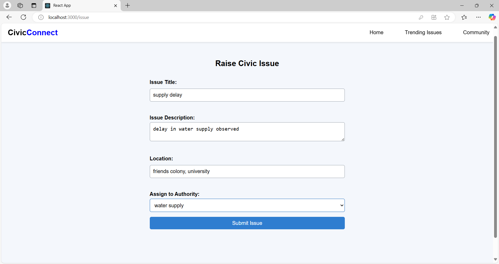

# CivicConnect

## Description
CivicConnect is a web application designed for community engagement and government interaction. It provides a platform for users to report issues, engage with community initiatives, and access government services.

## Installation Instructions

### Backend
1. Navigate to the `backend` directory.
2. Install dependencies:
   ```bash
   npm install
   ```
3. Create a `.env` file and configure your environment variables.
4. Start the server:
   ```bash
   npm start
   ```

### Frontend
1. Navigate to the `frontend` directory.
2. Install dependencies:
   ```bash
   npm install
   ```
3. Start the React application:
   ```bash
   npm start
   ```

## Usage
Once both the backend and frontend are running, you can access the application at `http://localhost:3000`. Use the navigation to explore different features.

## API Endpoints
- **POST /api/register**: Register a new user.
- **POST /api/auth**: Authenticate a user.
- **GET /api/government**: Retrieve government authorities.
- **GET /api/issues**: Get reported issues.
- **GET /api/community**: Access community initiatives.

## Frontend Features
- **Landing Page**: Introduction to the application.
- **Issue Reporting**: Users can report issues in the community.
- **Trending Topics**: View trending community topics.
- **Community Engagement**: Participate in community initiatives.
- **User Authentication**: Login and register functionalities.
- **Dashboard**: User dashboard for managing personal information.
- **Profile**: View and edit user profile.

## MVC Architecture
CivicConnect follows the MVC (Model-View-Controller) architecture:

- **Model**: Represents the data and business logic of the application. In the backend, models are defined for users, projects, issues, and government authorities, which interact with the database.
  
- **View**: The user interface of the application. In the frontend, React components serve as views, rendering the UI and displaying data to users.

- **Controller**: Handles user input and interacts with the model. In the backend, controllers manage the logic for processing requests, interacting with models, and returning responses.

## Images
### Screenshots of Different Pages



### System Architecture


## Contributing
Contributions are welcome! Please submit a pull request or open an issue for discussion.

## License
This project is licensed under the MIT License.
